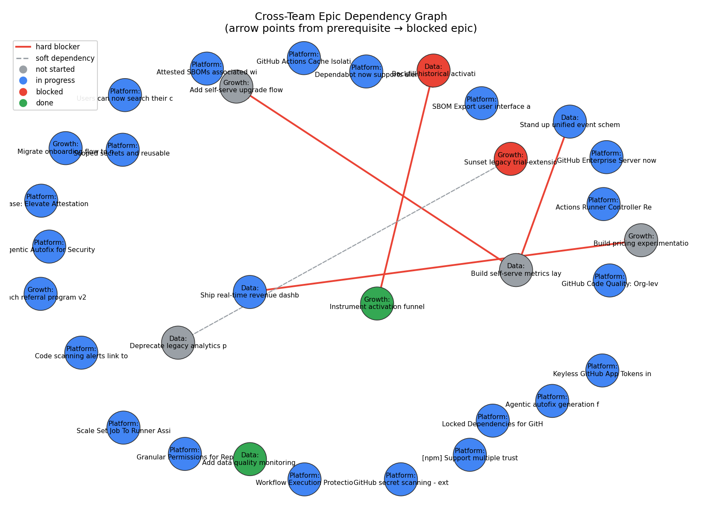

# Cross-Team Dependency Risk Report

## 🔑 Key Findings

- ✅ No circular dependencies detected in the current graph.
- 🎯 Highest blast-radius epic: **Stand up unified event schema v2** (Data, status: in_progress) — 2 other epic(s) are downstream of it. If this slips, treat it as a program-level risk, not just a Data risk.

## 🎯 Blast Radius Ranking (epics other work depends on)

| epic                                             | team   | status      |   epics_downstream_if_delayed |
|:-------------------------------------------------|:-------|:------------|------------------------------:|
| Stand up unified event schema v2                 | Data   | in_progress |                             2 |
| Instrument activation funnel events              | Growth | done        |                             1 |
| Deprecate legacy analytics pipeline              | Data   | not_started |                             1 |
| Ship real-time revenue dashboard                 | Data   | in_progress |                             1 |
| Build self-serve metrics layer for product teams | Data   | not_started |                             1 |

## 🚫 Active Hard Blockers (upstream work not yet done)

| blocked_team   | blocked_epic                                     | depends_on_team   | depends_on_epic                                  | depends_on_epic_status   |
|:---------------|:-------------------------------------------------|:------------------|:-------------------------------------------------|:-------------------------|
| Growth         | Add self-serve upgrade flow                      | Data              | Build self-serve metrics layer for product teams | not_started              |
| Growth         | Build pricing experimentation framework          | Data              | Ship real-time revenue dashboard                 | in_progress              |
| Data           | Build self-serve metrics layer for product teams | Data              | Stand up unified event schema v2                 | in_progress              |

## 🔗 All Cross-Team Dependencies

| Blocked Epic                                     | Depends On                                       | criticality     | Notes                                                                     |
|:-------------------------------------------------|:-------------------------------------------------|:----------------|:--------------------------------------------------------------------------|
| Add self-serve upgrade flow                      | Build self-serve metrics layer for product teams | hard_blocker    | Upgrade flow needs usage-based pricing signals from the metrics layer     |
| Sunset legacy trial-extension tool               | Deprecate legacy analytics pipeline              | soft_dependency | Old tool's usage is tracked in the legacy pipeline; want clean cutover    |
| Build pricing experimentation framework          | Ship real-time revenue dashboard                 | hard_blocker    | Experimentation framework needs real-time revenue data to evaluate tests  |
| Backfill historical activation events            | Instrument activation funnel events              | hard_blocker    | Can't backfill until the new event instrumentation ships and is validated |
| Build self-serve metrics layer for product teams | Stand up unified event schema v2                 | hard_blocker    | Metrics layer must be built on the new schema, not the old one            |

