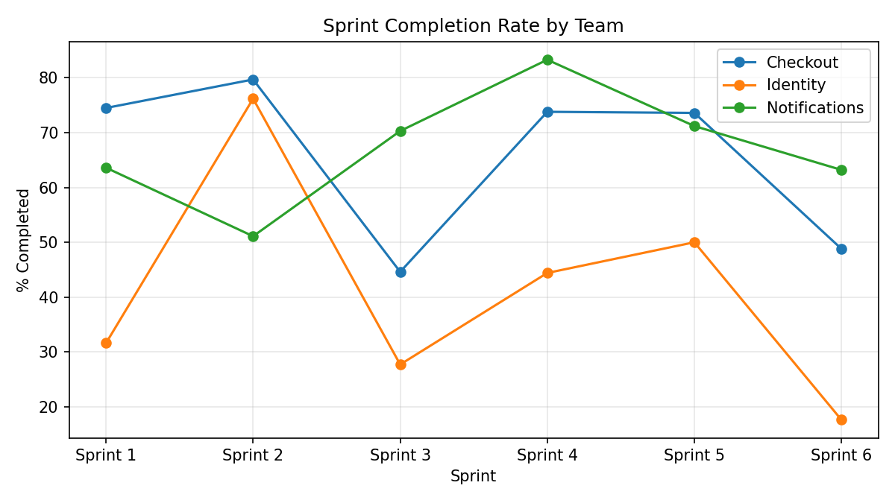
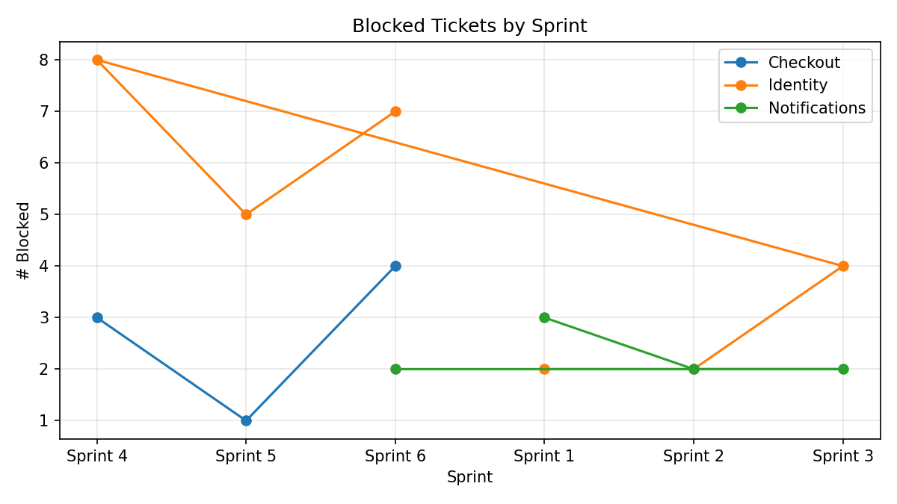
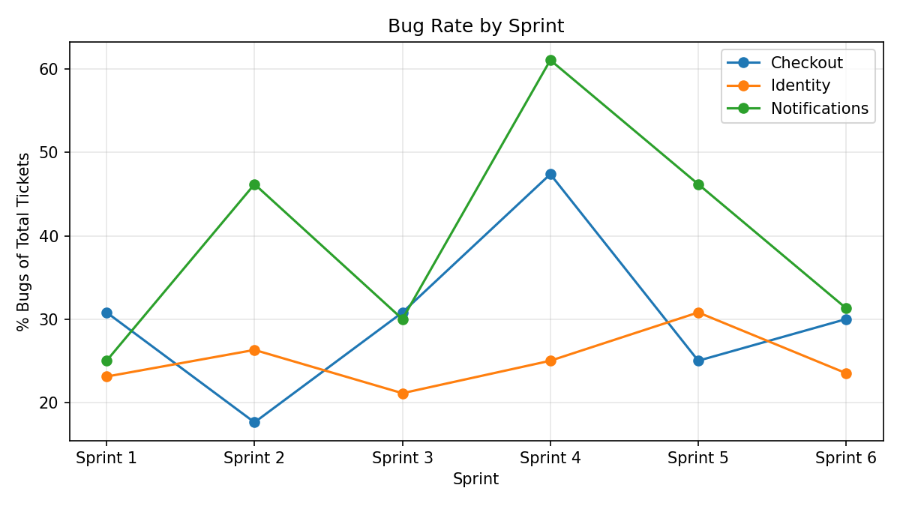

# Weekly Program Health Report

_Generated from `program_health.db` — data covers 2025-10-01 to 2025-12-10._

## 🔑 Key Insights

- ⚠️ **Checkout** completion rate dropped 35 pts (Sprint 2 → Sprint 3).
- ⚠️ **Checkout** completion rate dropped 25 pts (Sprint 5 → Sprint 6).
- ⚠️ **Identity** completion rate dropped 48 pts (Sprint 2 → Sprint 3).
- ⚠️ **Identity** completion rate dropped 32 pts (Sprint 5 → Sprint 6).
- 🚧 **Identity** has had rising blocked-ticket counts for 3 consecutive sprints — worth a dependency review.
- 🐛 **Checkout** had a bug-rate spike of 47.4% in Sprint 4 — likely worth a root-cause discussion.
- 🐛 **Notifications** had a bug-rate spike of 46.2% in Sprint 2 — likely worth a root-cause discussion.
- 🐛 **Notifications** had a bug-rate spike of 61.1% in Sprint 4 — likely worth a root-cause discussion.
- 🐛 **Notifications** had a bug-rate spike of 46.2% in Sprint 5 — likely worth a root-cause discussion.

## 📈 Velocity & Completion Rate

| sprint_name   |   Checkout |   Identity |   Notifications |
|:--------------|-----------:|-----------:|----------------:|
| Sprint 1      |       74.5 |       31.6 |            63.6 |
| Sprint 2      |       79.7 |       76.2 |            51.1 |
| Sprint 3      |       44.6 |       27.7 |            70.3 |
| Sprint 4      |       73.8 |       44.4 |            83.3 |
| Sprint 5      |       73.6 |       50   |            71.2 |
| Sprint 6      |       48.8 |       17.6 |            63.2 |

## 🚧 Blocked Tickets by Sprint

## 🐛 Bug Rate by Sprint

## ⏱️ Average Cycle Time (days, resolved tickets)

| team_name     |   avg_cycle_time_days |   tickets_resolved |
|:--------------|----------------------:|-------------------:|
| Notifications |                   7.5 |                 59 |
| Checkout      |                   6.4 |                 67 |
| Identity      |                   6.1 |                 42 |

## 🔴 Open P0/P1 Tickets (Cross-Team Risk Snapshot)

| team_name     | priority   | title                        | status      | blocked_reason                 |
|:--------------|:-----------|:-----------------------------|:------------|:-------------------------------|
| Checkout      | P0         | Feature-61: refactor module  | blocked     | blocked by third-party vendor  |
| Checkout      | P0         | Chore-101: add logging       | todo        | —                              |
| Identity      | P0         | Feature-236: refactor module | blocked     | dependency on Checkout release |
| Identity      | P0         | Feature-287: add validation  | in_progress | —                              |
| Identity      | P0         | Feature-293: refactor module | in_progress | —                              |
| Notifications | P0         | Bug-191: add validation      | todo        | —                              |
| Checkout      | P1         | Feature-5: refactor module   | in_progress | —                              |
| Checkout      | P1         | Bug-62: update flow          | blocked     | waiting on security sign-off   |
| Checkout      | P1         | Feature-79: add logging      | in_progress | —                              |
| Checkout      | P1         | Feature-80: refactor module  | blocked     | waiting on security sign-off   |
| Checkout      | P1         | Feature-88: update flow      | in_progress | —                              |
| Identity      | P1         | Feature-198: fix regression  | blocked     | waiting on design review       |
| Identity      | P1         | Feature-211: update flow     | todo        | —                              |
| Identity      | P1         | Feature-230: fix regression  | todo        | —                              |
| Identity      | P1         | Feature-244: fix regression  | todo        | —                              |
| Identity      | P1         | Bug-253: update flow         | blocked     | waiting on design review       |
| Identity      | P1         | Feature-275: add logging     | blocked     | blocked by third-party vendor  |
| Identity      | P1         | Chore-279: refactor module   | blocked     | dependency on Checkout release |
| Notifications | P1         | Feature-105: add logging     | blocked     | dependency on Checkout release |
| Notifications | P1         | Bug-112: fix regression      | todo        | —                              |
| Notifications | P1         | Chore-141: fix regression    | todo        | —                              |
| Notifications | P1         | Feature-142: add logging     | blocked     | waiting on security sign-off   |
| Notifications | P1         | Feature-170: update flow     | in_progress | —                              |
| Notifications | P1         | Feature-180: update flow     | blocked     | waiting on design review       |
| Notifications | P1         | Bug-193: improve latency     | todo        | —                              |
